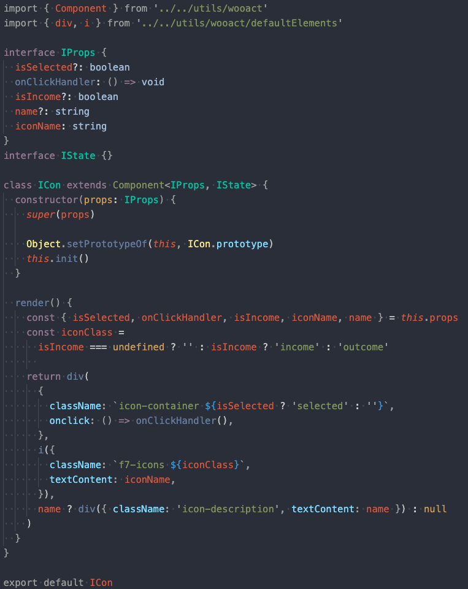

# hkb-2
남현우, 박지환 가계부 프로젝트

#### 위키 [링크](https://github.com/woowa-techcamp-2020/hkb-2/wiki)
#### 요구 사항 [링크](https://lucas.codesquad.kr/%EC%9A%B0%EC%95%84%ED%95%9C%ED%85%8C%ED%81%AC%EC%BA%A0%ED%94%842020/course/%EC%9B%B9%ED%92%80%EC%8A%A4%ED%83%9D/WEEK-5-%EA%B0%80%EA%B3%84%EB%B6%80(1-2)/%EB%AF%B8%EC%85%98-%EA%B0%80%EA%B3%84%EB%B6%80%EC%84%9C%EB%B9%84%EC%8A%A4)
<hr>


#### 프로젝트 소개
- 달별로 내역, 달력, 통계를 보여주는 가계부 웹 어플리케이션
- 내역을 추가, 업데이트 삭제가 가능하다.
- 통계는 막대 그래프와 파이 차트를 이용해 보여준다.

#### 기획
- [기획서](https://docs.google.com/presentation/d/17QLlxQxgFxyvvV6uh8_7sD3SeXIu5bN986nm94uycX8/edit#slide=id.g8b5e1ec338_0_0)
- 보완하거나 추가할 아이디어는 [추가 기획](https://github.com/woowa-techcamp-2020/hkb-2/wiki/%F0%9F%91%8D-%EC%B6%94%EA%B0%80-%EA%B8%B0%ED%9A%8D)에 추가

##### 가계부 내역 - transactions
<p align="center">
  
</p>
- 해당 월의 수입, 지출 내역을 확인할 수 있다.
- 사용한 지출 및 수입 내역을 추가로 기록할 수 있다.

##### 가계부 내역 - calendar
<p align="center">
  
</p>
- 해당 월의 수입, 지출 내역을 달력 형식으로 볼 수 있다.

##### 가계부 내역 - statistics
<p align="center">
  
  
</p>
- 해당 월의 지출 정보를 이용해 외부 라이브러리가 아닌 svg 포멧을 이용하여 그래프를 만든다.
- 애니메이션 기능을 추가했다.


#### 프로젝트 구조

```bash
hkb-2
│   ├── LICENSE
│   ├── README.md
│   ├── client
│   │   ├── babel.config.js
│   │   ├── node_modules
│   │   ├── package-lock.json
│   │   ├── package.json
│   │   ├── src
│   │   ├── tsconfig.json
│   │   ├── webpack.common.js
│   │   ├── webpack.dev.js
│   │   └── webpack.prod.js
│   └── server
│       ├── node_modules
│       ├── package-lock.json
│       ├── package.json
│       ├── public
│       └── src
```

## Set-up

1. `$ git clone https://github.com/woowa-techcamp-2020/hkb-2`
2. `$ cd ./client`
3. `$ npm i`
4. `$ cd ../server`
5. `$ npm i`

## Database Structure
<p align="center">
  
</p>

## 환경 변수 설정

**해당 프로젝트의 환경변수는 .env 파일에 담겨 있습니다.**

> .env 파일은 올라가 있지 않으니 sample.env에 값을 입력하고 .env로 파일이름을 바꾸시면 됩니다.
```bash
src
└─ server
   └─ sample.env
```

**sample.env**
```bash
DB_HOST=
DB_USER=
DB_NAME=
DB_PASS=
GITHUB_CLIENT_ID=
GITHUB_CLIENT_SECRET=
```

## Client

### 컴포넌트 만들기
```bash
$ ./create-wooact-component.sh 컴포넌트 이름
```

ex) `./create-wooact-component.sh` App

### Run dev server

```bash
cd hkb-2/client
npm run dev
cd hkb-2/server
npm run dev
```
> client의 경우 9000번 port에서 webpack-dev-server가 돌아갑니다.

> server의 경우 3000번 port에서 nodemone이 돌아갑니다.

```bash
client
│   ├── 기타 설정파일
│   ├── ...
│   ├── src
│   │   ├── components
│   │   │   ├── App
│   │   │   │   ├── App.ts
│   │   │   │   ├── App.scss
│   │   │   │   ├── index.ts
│   │   │   │   ...
│   │   ├── pages
│   │   │   ├── transaction
│   │   │   │   ├── Transaction.ts
│   │   │   │   ├── Transaction.scss
│   │   │   │   ├── index.ts
│   │   │   │   Routes.ts
│   │   │   │   ...
│   │   ├── stores
│   │   │   ├── transactionStore.ts
│   │   │   ├── index.ts
│   │   │   │   ...
│   │   ├── api
│   │   │   ├── transaction.ts
│   │   │   ├── apiRoutes.ts
│   │   ├── utils
│   │   │   ├── Wooact
│   │   │   │   ├── Component.ts
│   │   │   │   ├── createElement.ts
│   │   │   │   ├── ...
│   │   │   │   ├── index.ts
│   │   │   │   Store.ts
│   │   │   │   Routing.ts
│   │   │   │   ...
```

#### Component

재사용성을 높이기 위해, 가능한 작은 단위로 만들어 여러 곳에서 공통으로 이용가능한 컴포넌트로 만듬.

<p align="center">
  
</p>

예를 들어, `ICon` 컴포넌트는 5가지의 props를 선택적으로 받을 수 있는데, 해당 props를 통해 클릭 후 callback 함수, hover에 애니메이션 적용 여부, 아이콘 색상, 이름 표기 등의 정보를 조작할 수 있어 많은 곳에서 이용되어 재사용성을 극대화 하고 있음.

#### pages

history api를 이용한 커스텀 `Routing`을 제작하여, SPA 내에서 네비게이션(탭)간 전환이 가능하게 함. 하나의 page는 하나의 라우트를 의미하며, 여러 컴포넌트 들을 조합하여 화면을 구성함.

#### stores

여러 컴포넌트 및 페이지에서 공통적으로 사용되는 데이터 들을 store형태로 제작. 각각의 컴포넌트에서 `connectStore` 또는 `connectAction`으로 해당 스토어를 구독할 수 있음.

#### api

server와의 데이터 송수신이 가능한 ajax request를 따로 나누어 두었음.

#### utils

여러 곳에서 사용되는 메소드들을 외부에 빼서 재사용성을 높이도록 utils 폴더에서 따로 관리함.

##### wooact

해당 프로젝트의 근간이 되는 `react` 컴포넌트 형태의 모델로 작성된 모든 컴포넌트는 해당 `Component` 클래스를 상속받는 형태로 구성되어 있음. Dom api의 기본 createElement를 wrapping하여 jsx와 같이 컴포넌트의 render함수 내에서는 addEventListener, appendChild, setAttributes등의 메소드를 더 이상 호출하지 않도록 구성함.

##### store

`redux`의 flux 디자인 패턴을 차용한 observer 모델. 여러 컴포넌트에서 공통으로 사용되는 데이터를 자정하고 있으며, 컴포넌트와는 connectStore/Action api를 통해 데이터를 받거나 액션을 dispatch할 수 있는 구조로 연계되어 작성되어 있음. dispatch된 액션에 따라 새로운 상태값을 리턴하는 리듀서 형태로 데이터를 효율적이고 안전하게 관리하고 있음.

<p align="center">
  
  
</p>

##### Routing

`history` api를 wrapping 한 SPA용 커스텀 라우팅으로 탭간 전환 기능을 제공함. `pushState` 메소드와 `popstate` 이벤트를 이용하여 구성하였음.


